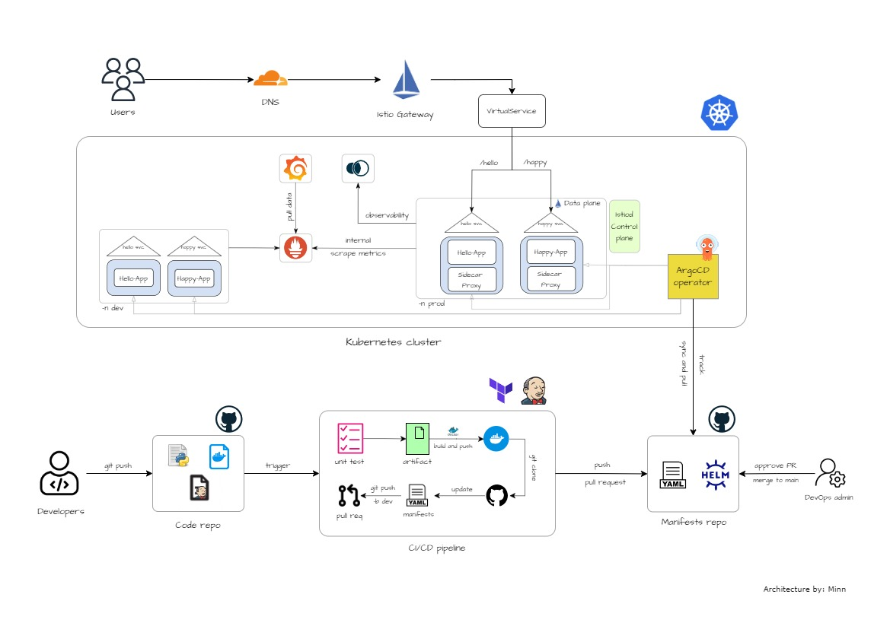

# Microservices with CI/CD, GitOps, and Service Mesh

This is an experimental project built as an active-recall for my learning on microservices and service mesh. You can read the article about this project on <a href="https://medium.com/@mtkforstudy.john86/microservices-with-ci-cd-gitops-and-service-mesh-07435fc69efc">my Medium blog post</a>.

> [!CAUTION]
> This mini project simulates an environment and its architecture might lack some best practices. It is advised against using it for production environments. 

## Architecture overview

## Prerequisites 

- AWS account
- kubectl cli
- helm cli
- terraform cli
- aws cli with credentials configured in `us-east-1`
- Docker Engine

## Project Hierachy

- `/happy_world_service`: code and Dockerfile for Happy World App
- `/hello_world_service`: code and Dockerfile for Hello World App
- `/jenkins`: Jenkinsfile for CI pipeline
- `/terraform`: terraform configuration files for Jenkins server
- `/test-code`: test cases for Python app(unused)
- `/userdata`: userdata for Jenkins server

## Technologies 

- AWS
- Python
- Docker
- Kubernetes
- Terraform
- ArgoCD
- Jenkins
- Istio
- Prometheus
- Grafana
- Kiali

You can find the Kubernetes manifests and Istio configurations at <a href="https://github.com/YU88John/k8s-gitops-manifests-repo">this repository</a>.

 

> DISCLAIMER: 
> Some parts of the project maybe misinterpreted. Any contribution is welcomed.